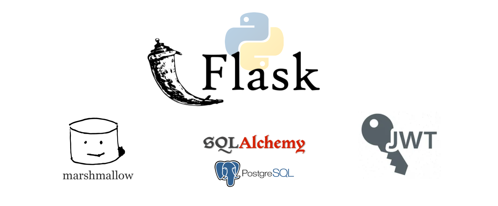

<h1 align="center">
	FLASK - API | ORM with SQLAlchemy
</h1>

<p align="center"></p>

[Work in progress...]


## Table of contents
* [General info](#general-info)
* [Technologies](#technologies)
* [Setup](#setup)
* [Flask](#flask)
* [Project Structure](#project-structure)
* [Models](#project-structure)
* [Schemas](#project-structure)
* [Inspiration](#inspiration)

## 🗣️ About

Simple Python Flask CRUD Application based on Flask-SQLAlchemy. In this application we are connecting a database where we add, retrieve, update and delete users. The app also handles users authentication through json web tokens.

## Technologies
Project is created with:
* FLASK
  * Flask-SQLAalchemy: Database ORM
  * Flask-Migrate: Database updates
  * Flask_Bcrypt: Encrypt passwords
  * Flask-Marshmallow: Helps with serializing and deserializing objects. Transform our SQLAlchemy objects into readable JSON data and helps to validate users data inputs.

## Setup
To run this project clone the project and:

```shell
cd ../<project-name>
virtualenv env --python=python3.9 # Recomended
source env/bin/activate # Recomended
pip install -r requirements.txt
python run.py
```

## Project Structure

### DATABASE SET UP - Flask-migrate
#### Flask_migrate
Flask extension that is used to migrate sqlalchemy based database models. When adding columns, migrate will compare the current version and the new version and create a script to migrate from one to the other.
Once you have data it becames very usefull extension.

#### Commands
```shell
python migrate.py db init # First time to create unexisting tables
```
```shell
python migrate.py db migrate
```
```shell
python migrate.py db upgrade
```


### Flask "Application Factory" Pattern

benefits:
* 1. Stop/avoid circular import;
* 2. Better and easier setup, for example, test, different environments;
* 3. More organized and readable project.


### Functional Based Structure

There are many ways to setup your project folder structure. One is by its function. For instance:
```
project/
  __init__.py
  models/
    __init__.py
    base.py
    users.py
    posts.py
    ...
  routes/
    __init__.py
    home.py
    account.py
    dashboard.py
    ...
  templates/
    base.html
    post.html
    ...
  services/
    __init__.py
    google.py
    mail.py
    ...

```

All things are grouped by its function. If it hehaves as a model, put it in models folder; if it behaves as a route, put it in routes folder. Build a create_app factory in project/__init__.py, and init_app of everything:

## Models

## Schemas

